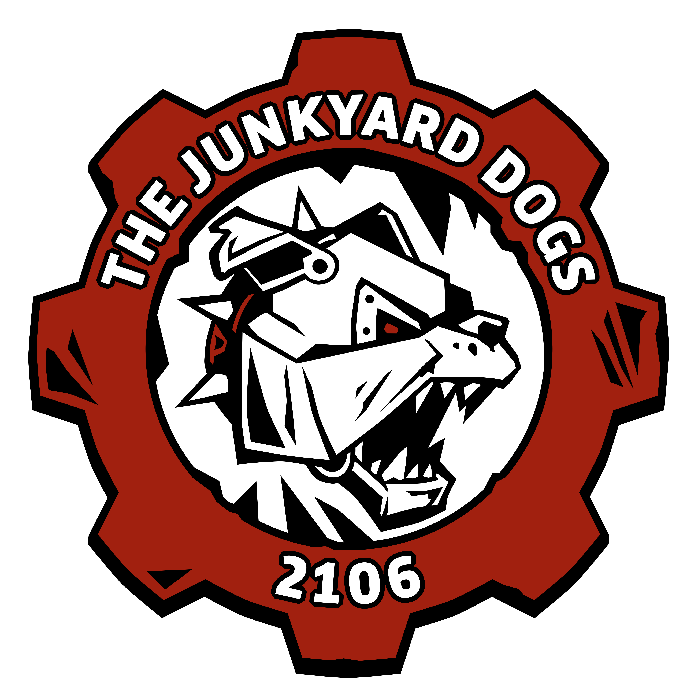
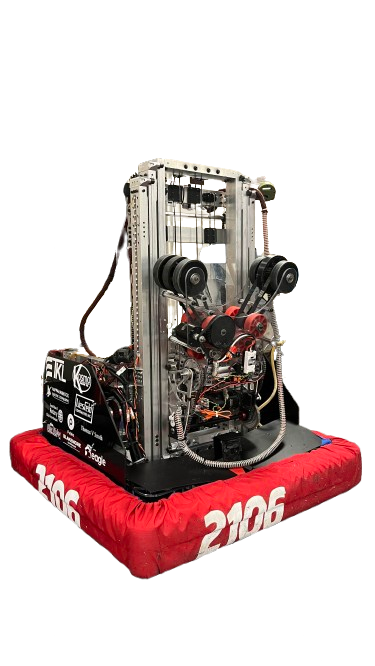

  <table>
    <tr>
      <td width="20%" valign="top">
        
      </td>
      <td width="80%" valign="top">
        <h1>FRC 2106 2025 Season Reefscape - SwerveDrive2025 - Guppy</h1>
        

          
          
        

        
This repository is updated with the latest code from team 2106's programming sub-team for the 2025 Reefscape season.

        
For any questions please visit our <a href="https://www.team2106.org/">website</a> and contact us there.

        

      </td>
    </tr>
  </table>

  <table>
    <tr>
      <td width="50%">
                
      </td>
      <td width="50%">
              
      </td>
    </tr>
  </table>

